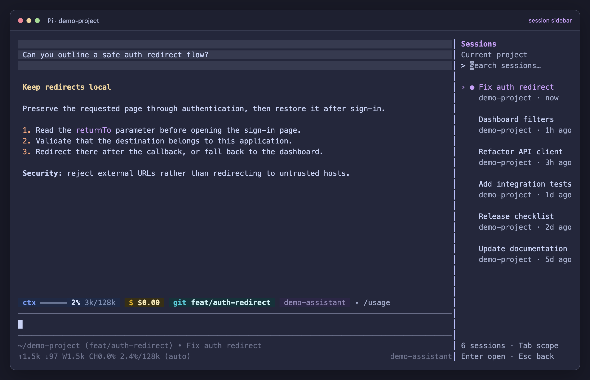

# Pi Session Sidebar

A Pi extension that pins a session picker on the right and **shrinks the chat to make room**. It preserves Pi's existing transcript, editor, footer, scrolling, and other widgets. It is not an overlay.

Install it once, then run normal `pi`. No separate launcher, fork, core patch, or special Pi command is required.



*Demo with generated sessions. The sidebar reserves space instead of covering the chat, and the usage bar stays in the chat column.*

## Install

Requires Pi 1.0.x and Node.js 22.19.0 or newer. Tested with stock Pi 1.0.0 and 1.0.4.

```sh
pi install git:github.com/abyigiter/pi-session-sidebar
```

Run `/reload` in an existing session, or start `pi` normally from your project directory:

```sh
cd /path/to/your/project
pi
```

Pi handles loading and updating this package just like other extensions, including `claude-usage-bar`. The sidebar appears by default in fullscreen mode.

For local development:

```sh
git clone https://github.com/abyigiter/pi-session-sidebar.git
cd pi-session-sidebar
pnpm install --frozen-lockfile --ignore-scripts
pnpm install:local
```

The local installer links `src/` into Pi's extensions directory so normal `pi` auto-discovers `index.ts`. It does not modify Pi executables, shell configuration, or credentials. Keep the checkout in place. The installer can be rerun and refuses to overwrite an unrelated existing extension.

`PI_CODING_AGENT_DIR` selects a custom Pi agent directory. `PI_SIDEBAR_EXTENSION_DIR` overrides the extension directory for local installation.

## Controls

| Action | Result |
| --- | --- |
| `Ctrl+O` while the sidebar is mounted | Move focus between the editor and sidebar |
| `Ctrl+Shift+S` or `/sessions` | Show/focus the sidebar, or return to the editor if already focused |
| Type in sidebar search | Match session names, first prompts, and project paths |
| `Up` / `Down`, `PageUp` / `PageDown` | Navigate results without scrolling the transcript |
| `Tab` in the sidebar | Switch current-project/all-project scope |
| `Enter` in the sidebar | Resume the selected session |
| `Escape` in the sidebar | Return to the editor without hiding the sidebar |
| `/sessions toggle` | Hide/show the sidebar and reclaim/reserve its width |

Sessions are ordered by recent activity. The active session is marked with `●`. Switching is blocked while the agent is busy or has queued messages; a non-empty text draft requires confirmation. Existing dialogs retain focus priority. Rename and delete remain in Pi's built-in `/resume` picker.

The sidebar reserves 42 columns. It collapses below 102 terminal columns or 12 rows and returns focus to the editor. It does not draw a pinned panel in regular, RPC, JSON, or print mode.

## Compatibility

**Experimental:** Pi exposes a public layout setter, but not a layout getter or input-listener priority. `src/layout.ts` isolates guarded access to the internal `layoutRoot` and `inputListeners` fields. It composes the original root with an `HStack`, rather than rebuilding Pi's transcript or replacing terminal rendering. Disposal restores the original root and removes only this extension's input handler.

If Pi changes these internal contracts, the adapter reports an unsupported layout instead of installing the sidebar. Extensions that also replace the entire TUI layout may conflict. Above/below-editor widgets, including the usage bar, remain in the original chat column.

There are no runtime dependencies beyond Pi's host-provided packages. Like other Pi extensions, this runs with Pi's operating-system permissions and does not add sandboxing.

## Verification

```sh
pnpm lint
pnpm typecheck
pnpm test
pnpm test:tui
```

Terminal tests require tmux. They launch **unmodified stock Pi** with an isolated configuration that installs this repository as a local package. A local faux provider supplies responses without paid calls. Tests cover draft protection, streaming, busy-switch guards, cross-project resume, resize, reload, modal focus, and regular/fullscreen transitions. A paused-process resize check distinguishes tmux clipping from an application-rendered frame.

To test another stock Pi executable, theme, or the usage-bar package:

```sh
PI_SIDEBAR_TEST_PI=/path/to/pi pnpm test:tui
PI_SIDEBAR_TEST_THEME=/path/to/theme.json pnpm test:tui
PI_SIDEBAR_TEST_USAGE_BAR=/path/to/claude-usage-bar pnpm test:tui
```

GitHub Actions checks stock Pi 1.0.0 and 1.0.4. The extension is MIT licensed.
